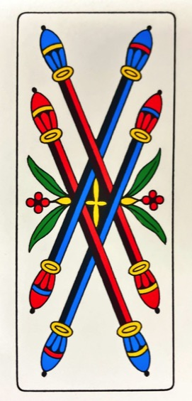
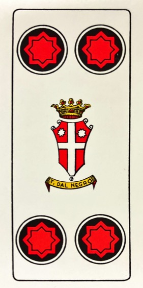
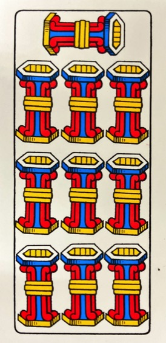

# Italian Decks

A repository of images of Italian card decks.

- [Italian Decks](#italian-decks)
  - [About](#about)
  - [Structure](#structure)
  - [Decks](#decks)
    - [Tarocco Bolognese](#tarocco-bolognese)
      - [Semi](#semi)
      - [Triunfi](#triunfi)
    - [Bresciane](#bresciane)

## About

The intention of this repository is to be used as a submodule for any italian card game applications.

It has been tricky to find all these in one place, so I have taken inspiration from the [Scopa repository by OMerkel](https://github.com/OMerkel/Scopa/tree/master).

## Structure

Decks can be found in the [`decks/`](./decks/) directory. cards are named by first name of suit and their rank

| suit               | initial |
| ------------------ | ------- |
| bastone / scettro  | b       |
| spade / scimitarra | s       |
| cuppe              | c       |
| denaro             | d       |

Rank starts from Ace and ends at king. For 40 card decks king is `10` and 52 decks king is `13`. Ace is always `1`.

e.g. the king of clubs in the napoletane deck would be `decks/b10.png`

## Decks

### Tarocco Bolognese

For Tarocco decks, there is a directory for the `semi/` and `triunfi/`. Triunfi are numbered `1` - `22`, e.g. `t1.png`, `t2.png`, `...`, `t22.png`.

#### Semi

|         |                   Cuppe                    |                   Denari                   |                   Spade                    |                  Bastone                   |
| ------: | :----------------------------------------: | :----------------------------------------: | :----------------------------------------: | :----------------------------------------: |
|    Asso |   |   |   |   |
|       6 |   |   |   |   |
|       7 |   |   |   |   |
|       8 |   |   |   |   |
|       9 |   |   |   |   |
|      10 |   |   |   |   |
|   Fante |   |   |   |   |
| Cavallo |   |   |   |   |
|  Regina |   |   |   |   |
|      Re |  |  |  |  |

#### Triunfi

|  |  |
| :------------------------------------------------------------: | :------------------------------------------------------------: |
|                             Matto                              |                             Bégato                             |

|  |  |  |  |
| :------------------------------------------------------------: | :------------------------------------------------------------: | :------------------------------------------------------------: | :------------------------------------------------------------: |
|                             Moro I                             |                            Moro II                             |                            Moro III                            |                            Moro IV                             |

|   |   |   |  |  |  |
| :-------------------------------------------------------------: | :-------------------------------------------------------------: | :-------------------------------------------------------------: | :-------------------------------------------------------------: | :-------------------------------------------------------------: | :-------------------------------------------------------------: |
|                                V                                |                               VI                                |                               VII                               |                              VIII                               |                               IX                                |                                X                                |
|  |  |  |  |  |  |
|                               XI                                |                               XII                               |                              XIII                               |                               XIV                               |                               XV                                |                               XVI                               |

|  |  |  |  |
| :-------------------------------------------------------------: | :-------------------------------------------------------------: | :-------------------------------------------------------------: | :-------------------------------------------------------------: |
|                              Sole                               |                              Luna                               |                              Mondo                              |                             Angelo                              |

### Bresciane

|   Grado |            Bastone            |             Cuppe             |            Denari             |             Spade             |
| ------: | :---------------------------: | :---------------------------: | :---------------------------: | :---------------------------: |
|       1 |   |   |   |   |
|       2 |   |   |   |   |
|       3 |   |   |   |   |
|       4 |   |   |   |   |
|       5 |   |   |   |   |
|       6 |   |   |   |   |
|       7 |   |   |   |   |
|       8 |   |   |   |   |
|       9 |   |   |   |   |
|      10 |  |  |  |  |
|   fante |  |  |  |  |
| cavallo |  |  |  |  |
|      re |  |  |  |  |